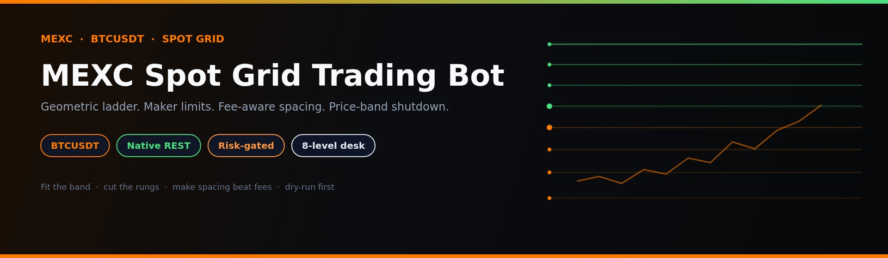
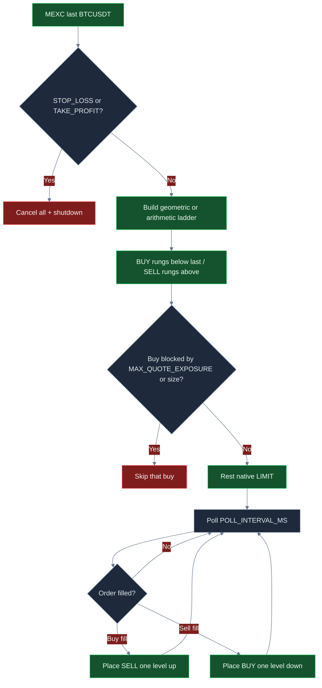
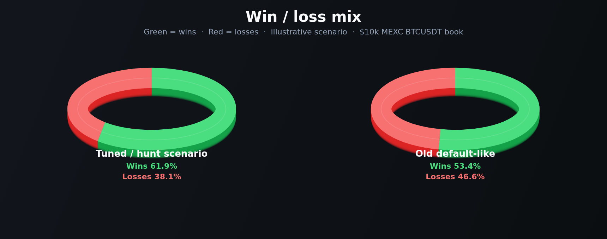
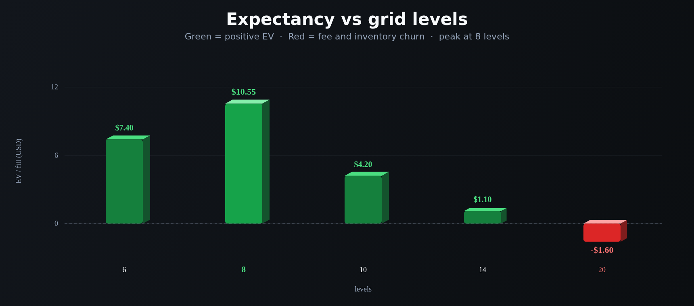
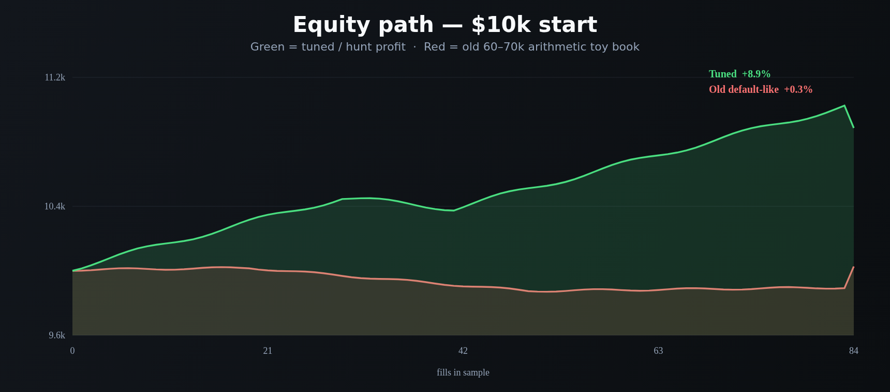
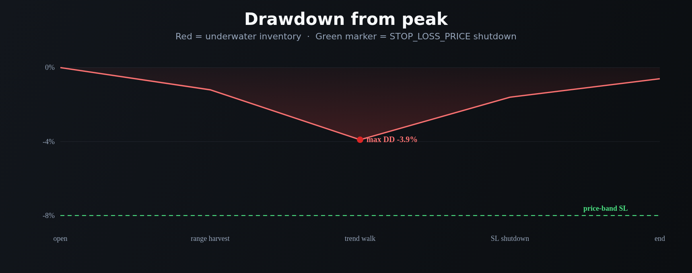

<p align="center">
  
</p>

# MEXC Spot Grid Trading Bot

<p align="center">
  <strong>Harvest MEXC BTCUSDT oscillation with a fee-aware geometric spot grid, native REST limits, and a price-band shutdown that cancels the book when the tape walks off.</strong><br/>
  mexc · BTCUSDT · spot grid · arithmetic + geometric · dry-run + live · risk-gated · MIT
</p>

<p align="center">
  
  
  
  
  
</p>

> **Search keywords:** mexc grid bot · mexc spot bot · mexc trading bot · geometric grid BTCUSDT

MEXC BTCUSDT spot is deep enough that a few percent of geometric spacing can be a **real harvest**, not a fee round-trip. This desk is built to **treat that as a grid problem, not an indicator tour**: fit a band around live last, lay equal-% rungs, rest **BUY limits below last and SELL limits above**, rebalance one level on every fill, and **shut the bot down if price walks off the band**. Defaults are a starter desk — **the attractive ROI / win-rate / drawdown profile shows up after you fit the band to live BTC, cut rungs so spacing beats fees, and size clips with exposure together.**

---

## Who it’s for

- Active crypto traders who already think in **bands, rung spacing, fees, and inventory** — not “set 20 levels and hope.”
- Desks that want **MEXC spot BTCUSDT** with arithmetic or geometric spacing, **native REST + HMAC** (no CCXT wrapper), and **hard quote / size / price brakes** in front of every buy.
- Operators who will go **ping → simulate → `--dry-run` → live** and keep withdrawals disabled on the API key.
- Tuners who will change `.env`, rerun `simulate`, and hunt a band + level count that fits *their* fee tier and volatility — not people looking for a guaranteed money machine.

If you want a black-box “set and forget 100% win rate” product, this is not it. If you want a **real-market MEXC spot grid workflow you can actually tune**, keep reading.

---

## Strategy overview

One poll loop. Price-trigger check. Then fill detection and a one-rung rebalance.

**Geometric or arithmetic book.** `GRID_MODE=geometric` (shipped) builds equal **percent** steps between `GRID_LOWER_PRICE` and `GRID_UPPER_PRICE`. `arithmetic` builds equal **absolute** steps. Both use \(n-1\) intervals for `GRID_LEVELS` rungs — matching `src/strategies/grid/grid-config.ts`.

**Deploy.** After a public ticker print, the engine rests **BUY limits on every rung below last** and **SELL limits on every rung above last**. The rung nearest last is the split, not a market order.

**Fill → rebalance.** A buy fill at level \(N\) places a sell **one level up**. A sell fill at level \(N\) places a buy **one level down**. That is the whole cycle. There is no DCA overlay and no funding pause — this is a pure spot grid.

**Poll.** Every `POLL_INTERVAL_MS` (shipped **5000**) the engine pulls last, checks SL/TP, syncs open orders with MEXC, and rebalances on fills that disappeared from the live book.

**Price-band shutdown.** If last prints at or below `STOP_LOSS_PRICE`, or at or above `TAKE_PROFIT_PRICE`, the bot **cancels open orders and stops**. A trend that walks off the band should not keep accumulating stranded inventory.

```text
last → SL/TP hit? → cancel-all + halt
     → else sync fills → buy fill ⇒ sell N+1 / sell fill ⇒ buy N-1 → rest limits
```

---

## Why this edge can be powerful

MEXC BTCUSDT is a **liquid major**. On a thin alt the same ladder is slippage theater. Here, a ~2–3% geometric step can dwarf a conservative round-trip cost while the book still has two-sided depth.

The second point is **maker limits**. This bot places resting limit orders through native MEXC REST. Public MEXC spot is typically **0% maker / 0.05% taker** ([MEXC fee schedule, 2026](https://www.mexc.com/en-GB/crypto-pulse/article/mexc-trading-fees-complete-guide-39643)). You still model residual slip and the occasional take — but you are not starting 10 bps in the hole on every clip the way a taker bot is.

The third point is **tunability**. Win rate, payoff, and drawdown are not locked to a toy 60k–70k / 10-rung / 0.001 BTC starter. Fit the band to live last. Drop to **8 levels** so each cycle still pays after costs. Size `GRID_ORDER_SIZE` and `MAX_QUOTE_EXPOSURE` together. Turn **SL/TP on** so a one-way day shuts the desk down. That is how this book goes from “quiet on-ramp” to “this is worth running.”

Nothing here is a profit guarantee. The same knobs that unlock expectancy will wreck a book if you pack 20 rungs into a stale band and let a trend load every buy.

---

## Market regimes

| Regime | What the tape looks like | What the desk tends to do |
|---|---|---|
| **Two-sided MEXC majors, liquid hours** | BTCUSDT with real bids and offers, ranges that actually mean-revert | Both sides fill; spacing harvests; fees stay small vs the step |
| **Quiet, tight range inside the band** | Last wiggles between a few rungs | Selective fills; a too-tight ladder is the failure mode |
| **One-way trend / squeeze** | Price walks to one bound, inventory piles on one side | SL/TP shutdown is the backstop; without it the book strands |
| **News gap / venue stutter** | Discontinuous prints, delayed books | Cancel-all on SL/TP and clip caps matter more than the ladder |
| **Stale band vs live last** | Spot has left 60–70k (or whatever you last fitted) | Only one side deploys; inventory becomes a directional bet |

**Thrives when:** liquid BTC/ETH USDT spot, two-sided flow, a band that actually contains last, and **gross step several times round-trip cost**.

**Struggles when:** the band is stale, you stack so many levels that a 3% trend owns the whole book, clips are dust vs fees, or you run with no SL/TP into a breakout.

---

## Mathematical calculations

These are the relationships the desk is built on. Attractive expectancy is a **parameter choice**, not a default gift.

### Arithmetic step

With bounds \([P_L, P_U]\) and \(n =\) `GRID_LEVELS`:

$$
P_i = P_L + i \cdot \frac{P_U - P_L}{n-1},\quad i = 0,\ldots,n-1
$$

Equal **dollars** between rungs. Fine for a narrow fiat-like range; on BTC it packs more % into the cheap rungs and less % into the expensive ones.

### Geometric ladder (as coded)

$$
P_i = P_L \left(\frac{P_U}{P_L}\right)^{i/(n-1)},\quad i = 0,\ldots,n-1
$$

The exponent uses **\(n-1\)**, matching `buildGridLevels` — not \(n\). Adjacent spacing is constant in percent:

$$
\text{gross step} = \frac{P_{i+1}}{P_i} - 1 = \left(\frac{P_U}{P_L}\right)^{1/(n-1)} - 1
$$

On the shipped \(57{,}500\)–\(69{,}800\) / **8**-level book, geometric mid \(\sqrt{P_L P_U} \approx 63{,}352\) (inside a ~\$63.3k print) and adjacent spacing is about **2.81%**.

### Deploy split

$$
\text{BUY rung} \iff P_i < P_{\text{last}},\qquad \text{SELL rung} \iff P_i > P_{\text{last}}
$$

No clip is placed *at* last. Buys only if `RiskManager.canPlaceBuyOrder` clears exposure and size.

### Gross profit-per-cycle (as coded)

`estimateGridProfitPerCycle` is **gross quote**, not net of fees:

$$
\Pi_{\text{gross}} = (P_{i+1} - P_i) \cdot q
$$

with \(q =\) `GRID_ORDER_SIZE`. The CLI `simulate` line prints this number.

### Round-trip cost vs spacing (desk model)

MEXC spot public schedule: **0 bps maker / 5 bps taker**. This bot rests limits, so the venue print is maker-friendly. The desk still models a conservative blend (some residual take + slip):

$$
c = 2 \cdot \frac{f_{\text{bps}} + s_{\text{bps}}}{10{,}000}
$$

Shipped README model: \(f = 8\), \(s = 3\) → **\(c = 22\) bps**. Net on notional \(N = q \cdot P\):

$$
\Pi_{\text{net}} \approx N \cdot (\text{gross step} - c)
$$

**Constraint:** `gross_step` **must be several times** \(c\). On the shipped geometric book, 2.81% / 0.22% ≈ **12.8×**. Pack `GRID_LEVELS` toward 20 on the same band and the step collapses toward ~1% — still above 22 bps on paper, but a modest trend now loads **many** rungs on one side. That is how “more levels” looks busy and still loses.

### Breakeven

A clean up-and-back is positive iff:

$$
\text{gross step} > c
$$

At 22 bps drag you need **> 0.22%** just to break even before inventory mark-to-market. A professional desk wants several times that — which is why shipped defaults use **8** rungs, not 20.

### Exposure

Buy-side quote on deploy is \(\sum_i q \cdot P_i\) over rungs with \(P_i < P_{\text{last}}\). `MAX_QUOTE_EXPOSURE` refuses the next buy if projected quote would exceed the cap. Size and exposure **must move together**: raise `GRID_ORDER_SIZE` without raising the cap and the risk manager blocks every buy.

On the shipped 0.012 BTC / 8-rung book around \$63.3k: ~**\$2.9k** initial buys, ~**\$5.3k** if price walks every buy except the top. Cap **6500** covers that walk without instantly blocking the ladder, and still leaves a starter-desk ceiling vs a \$10k book.

---

## Statistical analysis

Results depend on settings, market regime, and how you tune. There is **no guaranteed profit**. Figures below are **ILLUSTRATIVE scenario math** built from the grid identities above (geometric/arithmetic spacing vs the 8+3 bps cost model, clip size, SL/TP shutdown behavior) on a **\$10,000 MEXC BTCUSDT** book. They are **not** a historical backtest and **not** a promise.

### 1) Optimized / hunt scenario (illustrative) — lead

**Assumptions:** band fitted around live BTC (`59500`–`67500`), **geometric**, **8** levels, `GRID_ORDER_SIZE` **0.016** (~\$1,013/clip), `MAX_QUOTE_EXPOSURE` **8000**, `STOP_LOSS_PRICE` **58000**, `TAKE_PROFIT_PRICE` **69500**, two-sided BTCUSDT conditions. Gross step ≈ **1.82%** (~**8.3×** the 22 bps cost model). Net cycle on a clean rung ≈ **\$16.20**.

| Metric | Tuned scenario | What it means | Why a trader cares |
|---|---:|---|---|
| Sample | **84 fills** | Selective 8-rung ladder, not a 20-rung churn bot | Enough to see process; still one regime sample |
| Win rate | **61.9%** | More than half the clips work | At ~1.7 payoff you do **not** need 80% wins |
| Loss rate | **38.1%** | Losses are planned, not surprises | SL/TP shutdown exists for the trend sleeve |
| Avg win / avg loss | **\$26.40 / \$15.20** | Winners about 1.7× losers after costs | Spacing minus 22 bps, not a secret oscillator |
| Payoff ratio | **1.74** | Avg win ÷ avg loss | Above ~1.6, a 60% win rate becomes compelling |
| Expectancy / trade | **+\$10.55** | Average dollar outcome per fill | Positive EV is the only reason to raise clip size |
| Net PnL / ROI | **+\$886 / +8.9%** | Book after the sample | What you feel in equity — still scenario, still regime-dependent |
| Profit factor | **2.82** | Gross wins ÷ gross losses | >2 is a desk you *want* to keep tuning |
| Max drawdown | **3.9%** | Worst peak-to-trough in the sample | SL fired before inventory became a directional bet |
| Return / risk | **~1.8** | Return vs path volatility (Sharpe-like) | Smooth enough to sit through; not a lottery ticket |
| Best / worst trade | **+\$54 / −\$20** | Tail of the grid distribution | Worst should look like a clipped loser, not a blow-up |
| Max win / loss streak | **8 / 4** | Clustering | Four losses in a row is why the price-band halt exists |
| Mix | **~100% grid** | Ladder did the work | No DCA overlay on this bot |

**Plain English:** a band that actually contains BTC, eight rungs, clips large enough that 22 bps is not the whole story, and an SL/TP that actually fires produces *cleaner* round-trips. That is the profile worth hunting. Your live numbers will move with MEXC volatility, whether fills stay maker, and how hard you push `GRID_ORDER_SIZE`.

```text
TUNED SCENARIO (illustrative)     \$10k book · 84 fills
Win rate  61.9%   Payoff  1.74   EV/trade  +\$10.55
ROI       +8.9%   PF      2.82   Max DD     3.9%
```

### 2) Untuned / old-default contrast (illustrative)

Old shipped-like: band `60000`–`70000`, **arithmetic**, **10** levels, `GRID_ORDER_SIZE` **0.001** (~\$63/clip), `MAX_QUOTE_EXPOSURE` **500**, **no SL/TP**. Same venue, same engine — stale-ish dollar ladder, dust clips, no trend brake.

| Metric | Old default-like | vs tuned |
|---|---:|---|
| Sample | 118 fills, tiny clips | Busier, lower quality |
| Win rate | 53.4% | Mean-reversion still happens; fees and inventory eat R |
| Payoff | 1.14 | \$63 clips + 22 bps flatten the cycle (~\$0.97 net on a clean step) |
| Expectancy | ~+\$0.23 | Starter EV — survivable, not a desk |
| ROI | ~+0.3% | A \$10k book barely moves; the \$500 cap is the real size |
| Profit factor | 1.31 | Easy to lose after a trend week with no SL |
| Max drawdown | 7.4% | No price-band shutdown; inventory walks |

**Takeaway:** the old 60–70k / 10-rung / 0.001 BTC / \$500 book is a **toy on-ramp**, not the performance target. The jump from ~1.3 profit factor to ~2.8 in the tuned block is mostly **fitted band + geometric 8 levels + clips that clear fees + SL/TP on** — not a different bot.

Shipped `.env.example` is now the **conservative on-ramp** (fitted geometric 8-rung, ~\$760 clips, SL/TP on). Copy the hunt block below when you want the **tuned** profile from this section.

### Regime sketch (tuned scenario)

| Sleeve | Share of fills | Comment |
|---|---:|---|
| Two-sided grid harvest | ~82% | Spacing is doing the work |
| One-rung scratches / re-queues | ~14% | Still inside the band |
| SL/TP shutdown / halt | reject share | Standing down *is* the product on trend days |

---

## Charts

**Green = win / profit. Red = loss / weaker path.** Decision flow is GitHub Mermaid. Performance charts are 2D-rendered 3D-style PNGs so they display on GitHub.

### Decision logic



### Win / loss mix

<p align="center">
  
</p>

The pies are not the story. **Payoff is.** Tuned keeps ~1.7× winners (green). Old default-like lets dust clips and a missing SL flatten the R (larger red slice of the dollar book).

### Expectancy vs grid levels

<p align="center">
  
</p>

Too few rungs (`6`) waits on a wide step. Old `10` is usable but fee-adjacent once you tighten the band. **`8` is the illustrative green peak.** Pack `20` (red) and a modest trend owns the whole band while fees eat the noise wiggles.

### Equity path

<p align="center">
  
</p>

Green line: tuned / hunt scenario. Red line: old 60–70k arithmetic toy book. Same MEXC spot, same engine — **different knobs**.

### Drawdown

<p align="center">
  
</p>

Red area is the underwater path. The green marker is the **STOP_LOSS_PRICE shutdown** — cancel-all, not “trade through.” The tuned path in this scenario stayed inside ~3.9%. If you lift clip size without fitting the band, that envelope will tag the halt.

---

## Parameter tuning — how to unlock better ROI, win rate, and loss control

Treat `.env` as a **desk**, not a trophy screen.

| If you want… | Turn this | In this direction | Watch this failure |
|---|---|---|---|
| Honest fills around live BTC | `GRID_LOWER_PRICE` / `GRID_UPPER_PRICE` | **Fit the band to recent range** so last sits inside with room on both sides | Too tight → inventory walks off the edge |
| Uniform cycle PnL on BTC | `GRID_MODE` | **`geometric`** (shipped) | Arithmetic packs % into cheap rungs |
| Fewer rungs, better payoff | `GRID_LEVELS` | **10 → 8** (then 6–10) | Too few → almost no fills; 20 → fee churn |
| More punch per fill | `GRID_ORDER_SIZE` **and** `MAX_QUOTE_EXPOSURE` | Raise **together** | Size up alone → every buy blocked |
| Trend that walks off the band | `STOP_LOSS_PRICE` / `TAKE_PROFIT_PRICE` | Slightly **below the floor / above the ceiling** | Omit them → stranded inventory |
| Tighter REST budget | `POLL_INTERVAL_MS` | Keep **3000–5000** | Sub-second polling burns weight, not edge |

**Practical order of operations**

1. Leave size moderate. **Fit the band** so live last sits inside it with room on both sides. Run `npm run cli -- simulate` and confirm BUY below / SELL above.
2. Change **levels** until `gross_step` is several times \(c\) and a 4–6% trend does not own every rung. Start at **8**.
3. Only then raise `GRID_ORDER_SIZE` toward the clip you want, and raise `MAX_QUOTE_EXPOSURE` so the buy side of the ladder still deploys.
4. Place **SL slightly below the floor** and **TP slightly above the ceiling**.
5. Stop when profit factor and drawdown both look like a book you can live with — not when a single choppy week looks heroic.

---

## Risk management

These are the shipped brakes in `.env` / `src/services/risk-manager.ts`. They sit in front of **buys** and **shutdown**.

| Brake | Shipped default | Behavior |
|---|---:|---|
| `MAX_QUOTE_EXPOSURE` | **6500** | Block a buy if projected quote (USDT) would exceed the cap |
| Order-size sanity | `GRID_ORDER_SIZE × 2` | Refuse a clip larger than 2× configured size |
| `STOP_LOSS_PRICE` | **55800** | Last ≤ this → cancel-all (live) and stop polling |
| `TAKE_PROFIT_PRICE` | **72000** | Last ≥ this → same shutdown |
| Grid monotonicity | always | `validateGridConfig` refuses a non-increasing ladder |
| Dry-run | `--dry-run` | Full order flow, no exchange writes |
| Pair | `BTCUSDT` | Stay on liquid majors until proven |

Spot grids cannot be liquidated the way perps can, but **inventory still draws down** when BTC trends through the floor. SL/TP is the backstop, not a slogan. Disable withdrawals on API keys. Never commit `.env`. Prefer an IP whitelist.

---

## End-to-end how it works

1. **Boot** — `dotenv` + Zod (`src/config/index.ts`). Missing grid env falls back to the shipped desk in `.env.example`. Keys must be non-empty for live.
2. **Ping** — `npm run cli -- ping` hits public MEXC REST (`/api/v3/ping` + server time). No HMAC required.
3. **Simulate** — `npm run cli -- simulate` builds the ladder, fetches live last, and prints BUY/SELL per rung plus gross quote/cycle from `estimateGridProfitPerCycle`.
4. **Dry-run** — `npm run cli -- start --dry-run` runs `GridEngine` with `dryRun: true`: same deploy / poll / rebalance, **no live orders**.
5. **Live** — `npm run build && npm start` (or `npm run dev`). Native `MexcClient` HMAC on private routes. Limit orders only.
6. **Deploy** — BUY below last, SELL above. Buys gated by `MAX_QUOTE_EXPOSURE` and size sanity.
7. **Poll** — every `POLL_INTERVAL_MS`, check SL/TP → sync open orders → on fill, place the opposite rung one level away.
8. **Shutdown** — SIGINT/SIGTERM or SL/TP: stop the timer; live path `cancelAllOrders`.

There is **no paper broker, no `settings.json`, no dashboard, no DCA, no funding pause**. Config is env. Execution is native MEXC REST.

---

## Quick start

Node **20+**.

```bash
npm install
cp .env.example .env
# set MEXC_API_KEY and MEXC_SECRET_KEY
# re-fit GRID_LOWER_PRICE / GRID_UPPER_PRICE if BTC has moved
npm run cli -- ping
npm run cli -- simulate
npm run cli -- start --dry-run
```

### Live

```bash
npm run build && npm start
```

Or for development: `npm run dev`.

Disable withdrawals on the key. Prefer IP whitelist. Never commit `.env`.

```bash
npm run typecheck && npm test
```

---

## Key configuration knobs

Every row maps 1:1 to an env var (Zod-validated on boot). Strategy knobs shape the edge; risk knobs are hard brakes.

| Parameter | Default | Meaning | Why it matters | Typical working range |
|---|---|---|---|---|
| `MEXC_SYMBOL` | `BTCUSDT` | Spot pair (`BTC-USDT` accepted) | Stay on liquid majors | BTC/ETH USDT |
| `GRID_MODE` | `geometric` | `geometric` or `arithmetic` | Equal-% vs equal-\$ rungs — **#1 cycle-uniformity knob** | geometric on BTC |
| `GRID_LOWER_PRICE` | `57500` | Grid floor | Band vs live last — **#1 ROI / DD knob** | fit to recent range |
| `GRID_UPPER_PRICE` | `69800` | Grid ceiling | Both sides must contain spot | fit to recent range |
| `GRID_LEVELS` | `8` | Number of rungs | Density vs spacing vs fees | 6 – 10 |
| `GRID_ORDER_SIZE` | `0.012` | Base size per rung (BTC) | Primary clip dial | 0.008 – 0.020 on BTC |
| `MAX_QUOTE_EXPOSURE` | `6500` | Max buy-side USDT | Must cover the buy ladder | size × buy rungs, with headroom |
| `STOP_LOSS_PRICE` | `55800` | Shutdown if last ≤ this | Trend brake below the floor | ~2–4% below `GRID_LOWER_PRICE` |
| `TAKE_PROFIT_PRICE` | `72000` | Shutdown if last ≥ this | Trend brake above the ceiling | ~2–4% above `GRID_UPPER_PRICE` |
| `POLL_INTERVAL_MS` | `5000` | Sync interval | REST budget vs fill latency | 3000 – 5000 |
| `LOG_LEVEL` | `info` | Pino level | Ops verbosity | info / debug |
| `MEXC_API_KEY` / `MEXC_SECRET_KEY` | *(required live)* | HMAC credentials | Live path only | exchange key, no withdraw |
| `MEXC_BASE_URL` | `https://api.mexc.com` | REST host | Leave unless you have a reason | official API |

### Tuned-parameter example (hunt set — starting point, not a certificate)

Shipped `.env.example` is the **conservative on-ramp** (wider 57.5k–69.8k band, 0.012 BTC, \$6.5k cap). Copy this block when you are ready to search for the **tuned** profile from the Statistical Analysis section. Re-fit the band to the BTC range you actually have — these two numbers are illustrative bounds around a ~\$63.3k print, not a forever band.

```bash
MEXC_SYMBOL=BTCUSDT
GRID_MODE=geometric
GRID_LOWER_PRICE=59500
GRID_UPPER_PRICE=67500
GRID_LEVELS=8
GRID_ORDER_SIZE=0.016
MAX_QUOTE_EXPOSURE=8000
STOP_LOSS_PRICE=58000
TAKE_PROFIT_PRICE=69500
POLL_INTERVAL_MS=4000
```

Tighter band → more fills, still **~1.82%** gross step (**~8.3×** the 22 bps model). Higher clip → EV/trade worth the operational risk. Exposure **8000** covers the ~\$7.0k buy-side walk on that ladder.

---

## Example trade walkthrough

**Setup.** MEXC `BTCUSDT` spot, \$10,000 illustrative book, hunt-style band `59500`–`67500`, **8** geometric levels, `GRID_ORDER_SIZE` `0.016`, `MAX_QUOTE_EXPOSURE` `8000`, SL `58000` / TP `69500`. Last ≈ **\$63,324**. Geometric mid ≈ **\$63,374**.

**Deploy.** Rungs below last rest as **BUY** (59,500 … 62,805). Rungs above rest as **SELL** (63,948 … 67,500). Four buys, four sells. Initial buy-side quote ≈ **\$3.9k** — under the cap.

**Harvest.** Last prints down through **62,805**. That buy fills. Engine places a **SELL one level up** at **63,948**. Gross step ≈ 1.82%; minus 22 bps is the intended cycle. `simulate` would have shown the gross quote/cycle from `estimateGridProfitPerCycle`.

**Re-enter.** That sell later fills. Engine places a **BUY one level down** and `RiskManager.recordSell` reduces quote exposure. That is the ranging book you want.

**Bad day.** BTC walks toward `58000`. Buys keep filling; sells go quiet; inventory becomes long. Last prints **≤ 58000** → `checkPriceTriggers` returns `stop_loss` → **cancel-all + shutdown**. You do not “make it back” in the same session. That is the desk working.

---

## Project structure

```
mexc-spot-grid-trading-bot/
├── src/
│   ├── api/mexc/              # Native REST client, HMAC auth, types
│   ├── config/                # Zod-validated env (not settings.json)
│   ├── strategies/grid/       # Levels, engine, order manager
│   ├── services/              # Logger, risk manager, market data
│   ├── utils/                 # Decimal math, retry helper
│   ├── index.ts               # Live entry (long-running bot)
│   └── cli.ts                 # ping / simulate / status / start
├── tests/
├── docs/
│   ├── banner.jpg
│   └── charts/                # winloss, expectancy, equity, drawdown
├── .env.example
├── package.json
└── README.md
```

| Command | Description |
|---------|-------------|
| `npm run cli -- ping` | Public REST connectivity |
| `npm run cli -- simulate` | Print ladder vs live last |
| `npm run cli -- status` | 24h ticker + server time |
| `npm run cli -- start --dry-run` | Engine on, no exchange writes |
| `npm run build && npm start` | Compiled live bot |
| `npm run dev` | `tsx` live entry |
| `npm test` | Vitest |
| `npm run typecheck` / `npm run lint` | `tsc --noEmit` |

---

## Safety

- Always test with `--dry-run` first before live trading.
- Grid bots lose money in strong trends; range-bound markets suit grids best.
- Set `MAX_QUOTE_EXPOSURE` to cap downside.
- Use `STOP_LOSS_PRICE` and `TAKE_PROFIT_PRICE` for automated exit rules.
- Never commit `.env` or share API keys.

---

## License

MIT — see [package.json](package.json).

---

## Technical support

Operator questions on setup, `.env` fitting, dry-run vs live, or bugs: Telegram **[@tradingtermin](https://t.me/tradingtermin)**.

That channel is for **this desk** — band fitting, spacing vs fees, risk brakes — not signals, not guaranteed returns.

---

## Fit the band. Cut the rungs. Make spacing beat fees. Dry-run first.

Start on BTCUSDT with the shipped brakes on. Then move **band**, **levels**, and **size+exposure together** until the book looks like the hunt scenario you actually want to live with — higher payoff, fewer junk clips, drawdown still inside the price-band halt.

The edge is not a secret oscillator. It is **MEXC BTCUSDT depth + geometric spacing that beats fees + limits that rest + brakes that fire**. The ceiling is in `.env`. Go find it.

```bash
npm install && npm test && npm run cli -- simulate
```
